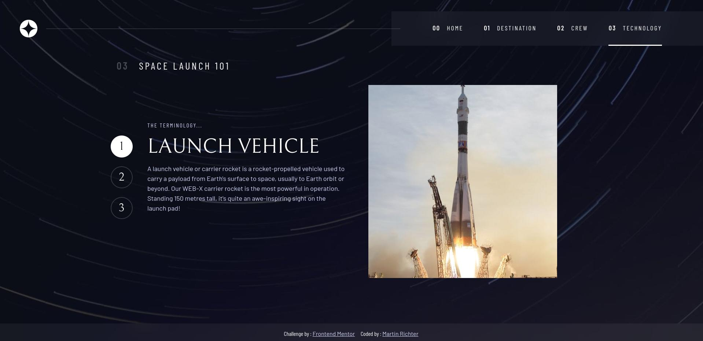
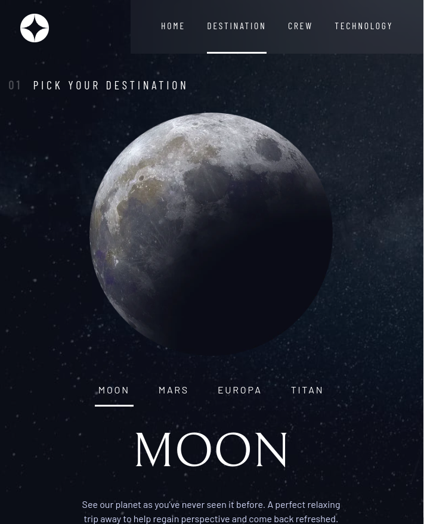
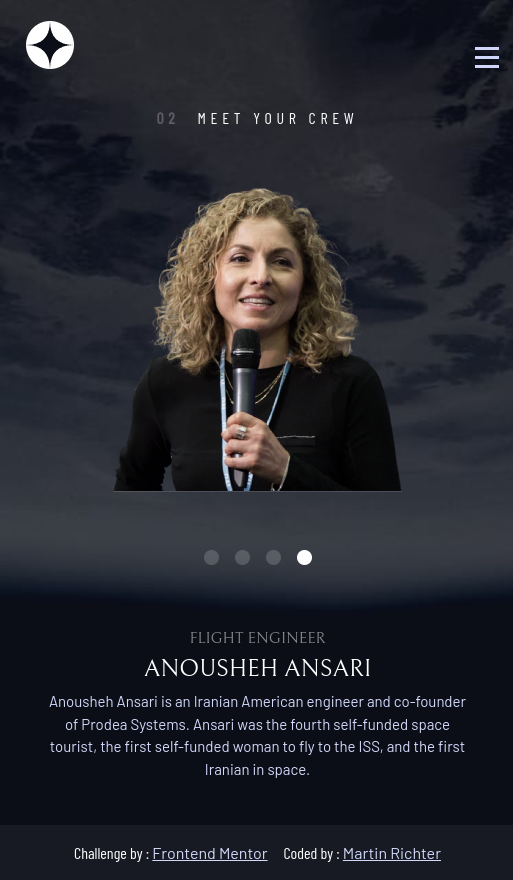
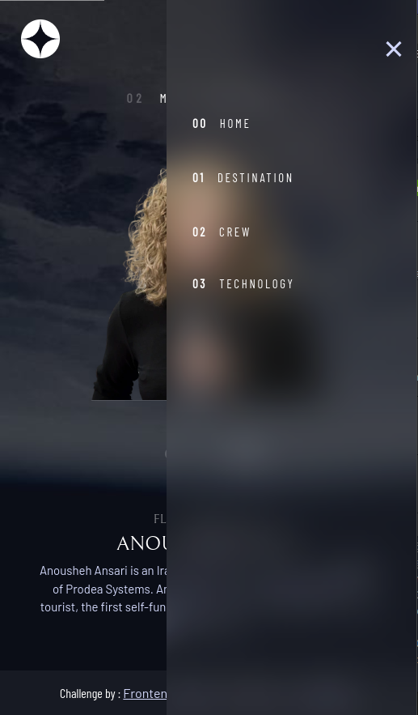

# Frontend Mentor - Space tourism website solution

This is a solution to the [Space tourism website challenge on Frontend Mentor](https://www.frontendmentor.io/challenges/space-tourism-multipage-website-gRWj1URZ3). Frontend Mentor challenges help you improve your coding skills by building realistic projects.

## Table of contents

-   [Overview](#overview)
    -   [The challenge](#the-challenge)
    -   [Screenshot](#screenshot)
    -   [Links](#links)
-   [My process](#my-process)
    -   [Built with](#built-with)
    -   [What I learned](#what-i-learned)
-   [Author](#author)
-   [Acknowledgments](#acknowledgments)

## Overview

### The challenge

Users should be able to:

-   View the optimal layout for each of the website's pages depending on their device's screen size
-   See hover states for all interactive elements on the page
-   View each page and be able to toggle between the tabs to see new information

### Screenshot






### Links

-   Solution URL: [Frontend Mentor Solution Page](https://your-solution-url.com)
-   Live Site URL: [Live Application](https://main--space-tourism-karag2006.netlify.app/)

## My process

### Built with

-   Semantic HTML5 markup
-   Sass/Scss (https://sass-lang.com/)
-   Typescript (https://www.typescriptlang.org/)
-   [React](https://reactjs.org/) - JS library
-   [Next.js](https://nextjs.org/) - React framework

### What I learned

First Frontend Mentor Project in a long time.
First time on my own working with next.js
Also First Time using Typescript on my own

Learned a few CSS Tricks, like assigning custom properties with a fallback value, used if the custom property is undefined

```css
.some-grid-container {
    column-gap: var(--container-gap, 2rem);
}
```

Also learned more about the use of useEffect and custom hooks, as well as using window and document inside react / next.js

## Author

-   Frontend Mentor - [@Karag2006](https://www.frontendmentor.io/profile/Karag2006)
-   GitHub - [Karag2006](https://github.com/Karag2006)
-   GitLab - [@martin.richter2006](https://gitlab.com/martin.richter2006)
-   Twitter - [@karag2006](https://www.twitter.com/karag2006)
-   Mastodon - [@karag@fosstodon.org](https://fosstodon.org/@karag)
